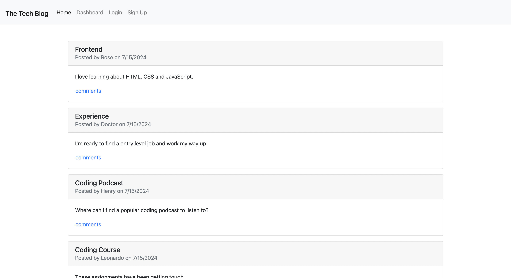

# Tech Blog

## Description
Tech Blog is a CMS-style blog site where users can publish their blog posts
and comment on other developers' posts. It also has the option to update or delete
your own posts from the dashboard.

## Built with
- node js
- express js
- postgreSQL database
- express handlebars
- eequelize
- express session
- bcrypt
- bootstrap

## Links
[Link to Live Site (Render)](https://tech-blog-jtbf.onrender.com)

## Screenshot
